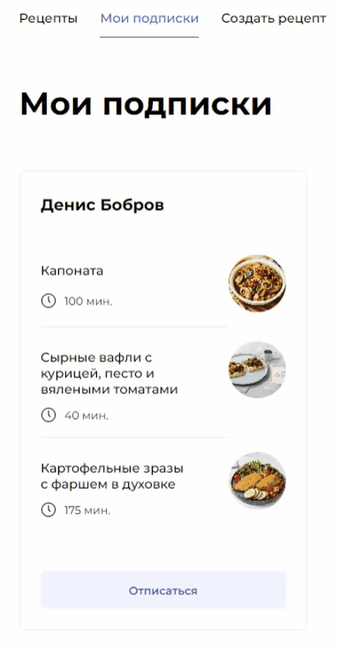

# Foodgram - продуктовый помощник
"Фудграм" - это веб-платформа, предназначенная для любителей готовить и делиться своими кулинарными творениями. Пользователи могут создавать, публиковать и просматривать рецепты, а также взаимодействовать с другими участниками сообщества.

[](gif)

## Содержание

- [Доступ](#доступ)
- [Функциональность](#функциональность-api)
- [Технологии](#технологии)
- [О проекте](#о-проекте)
- [Установка и настройка](#установка-и-настройка)
  - [Backend (Django)](#backend-django)
  - [Frontend (React)](#frontend-react)
  - [Docker (деплой)](#docker)
- [Запросы к API](#запросы-к-api)

## Доступ
Проект размещён в Интернете и доступен по [ссылке](http://158.160.81.117/).

## Функциональность API

Документация к API расположена по [ссылке](https://dew-77.github.io/foodgram-project-react/).

## Технологии
Backend проекта написан на **Python 3.12** с использованием фреймворка **Django** и инструментария **Django REST Framework**. Система аутентификации основана на библиотеке **JWT**. 
В качестве базы данных используется **PostgreSQL 13**.
Frontend-часть приложения представляет собой одностраничное SPA-приложение, написанное на фреймворке **React**.

## О проекте

Добро пожаловать в "Фудграм" – виртуальное место для кулинарных открытий и обмена впечатлениями от блюд:
1. *Главная страница*: Список интересных рецептов с простой навигацией.
<p align="center">

</p>

2. *Страница рецепта*: Любуйтесь описанием и добавляйте в избранное или список покупок.
<p align="center">

</p>

3. *Страница пользователя*: Имя, рецепты и возможность подписки.

<p align="center">

</p>

4. *Страница подписок*: Посмотрите, что готовят те, на кого вы подписаны.
<p align="center">

</p>

5. *Избранное*: Соберите свою коллекцию любимых рецептов.
<p align="center">

</p>

6. *Список покупок*: Создавайте список продуктов для будущих кулинарных экспериментов.
[](docs/gifs/gif6.gif)
<p align="center">

</p>

7. *Создание и редактирование рецепта*: Оформляйте свои кулинарные шедевры и редактируйте их.
<p align="center">

</p>

8. *Фильтрация по тегам*: Находите рецепты по интересующим вас тегам.
<p align="center">

</p>

9. *Система регистрации и авторизации*: Присоединяйтесь, чтобы стать одним из участников кулинарного сообщества!
<p align="center">

</p>


## Установка и настройка
1. Установите [Docker](https://docs.docker.com/engine/install/) на сервер
2. Склонируйте репозиторий:
```bash
git clone git@github.com:dew-77/foodgram-project-react.git
cd foodgram-project-react
```
3. Скопируйте файлы docker-compose.yml и nginx.conf из директории infra на сервер:
```bash
scp docker-compose.yml <username>@<host>:/home/<username>/docker-compose.yml
scp nginx.conf <username>@<host>:/home/<username>/nginx.conf
``3
4. Создайте на сервере файл *.env*:
```bash
# Для Linux
touch .env
# Для Windows
NUL> .env
```
5. Наполните файл *.env* данными по следующему шаблону:
```env
POSTGRES_USER=<пользователь БД>
POSTGRES_PASSWORD=<пароль от БД>
POSTGRES_DB=<название БД>

DB_HOST=db
DB_PORT=5432

SECRET_KEY=<ключ проекта Django>
DEBUG=False
ALLOWED_HOSTS=<IP вашего сервера или доменное имя>
```
6. Перейдите в папку *infra* и выполните команду сборки:
```bash
sudo docker-compose up -d --build
```
7. (Только для первого деплоя) Выполните команды:
```bash
sudo docker-compose exec backend python manage.py collectstatic --noinput
sudo docker-compose exec backend python manage.py migrate --noinput
sudo docker-compose exec backend python manage.py predata
``` 
8. Создайте суперпользователя:
```bash
sudo docker-compose exec backend python manage.py createsuperuser
```
9. После действий выше вы сможете обратиться к проекту по IP сервера или доменному имени

## Запросы к API
В директории *postman-collection* расположена коллекция тестов ([как запустить тесты](postman-collection/README.md))


